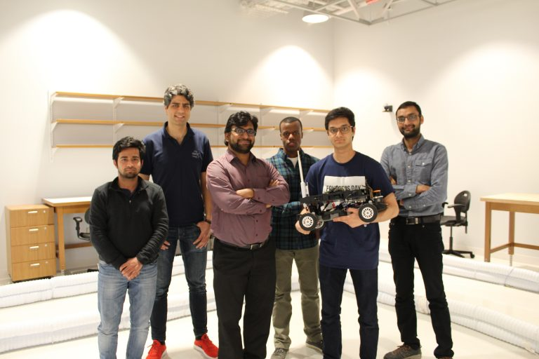

# Racing Huskies

## Team Name

We are the **Racing Huskies**.
Here are our team members:

- Dr. Parasara Duggirala
- Nandan Tumu (BS Student)
- Abolfazl Karimi (PhD Student)
- Reynaldo Morillo (PhD Student)
- Manish Goyal (PhD Student)
- Bineet Ghosh (PhD Student)

## Vehicle Configuration

We use the V1 Platform, and the LiDAR. No other sensors factored into our decision-making. We do not have a VESC or any custom drivetrain components.

## Repository Organization

The catkin workspace is in `AutoCar`. The code on the Teensy is in `AutoCar/TeensyFirmware`

## How to Build

Check out the [GETTINGSTARTED.md](AutoCar/GETTINGSTARTED.md) file.

## Features

We only use one sensor, and the stock motor controller!